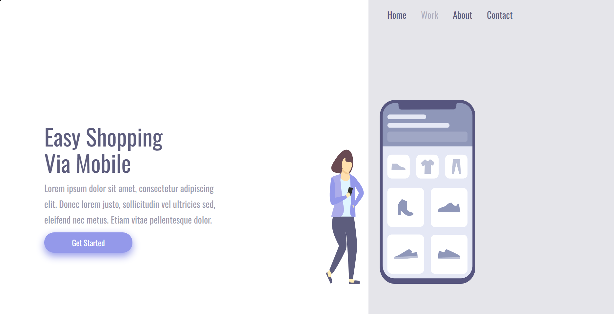
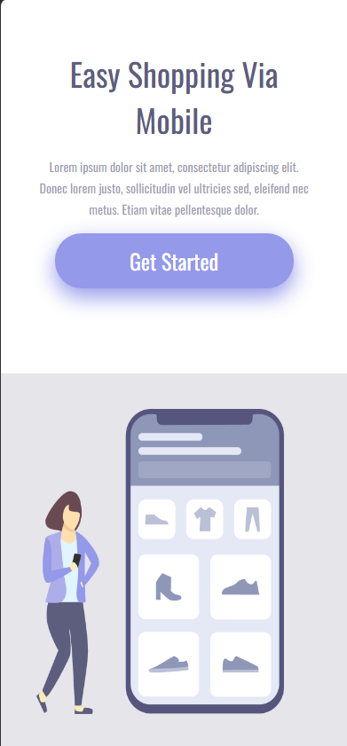

# Easy Shopping

Landing page de e-commerce construída a partir de um layout do Figma, com o objetivo de acertar a responsividade em três tamanhos de tela: desktop, tablet e celular.

**[▶ Ver no ar](https://guilhermeoliveira337.github.io/easy-shopping/)**



## O foco: responsividade

O projeto é curto de propósito. O exercício não era quantidade de seções, e sim fazer **o mesmo HTML** se comportar corretamente em três larguras diferentes, sem duplicar marcação e sem quebrar o alinhamento em nenhuma delas.

- **Desktop** — conteúdo e imagem lado a lado
- **Tablet** — proporções ajustadas, mesma estrutura
- **Celular** — empilhamento vertical, tipografia e espaçamentos redimensionados



## O que aprendi

Foi aqui que passei a tirar as medidas direto do Figma em vez de estimar no olho. Centralização, espaçamento e proporção deixaram de ser tentativa e erro e viraram número — e o resultado ficou visivelmente mais próximo do layout original.

Também foi o projeto em que entendi media query como ponto de quebra escolhido pelo conteúdo, não como três larguras decoradas.

## Tecnologias

`HTML5` · `CSS3 (Flexbox, Media Queries)` · `Figma`

## Rodando localmente

```bash
git clone https://github.com/GuilhermeOliveira337/easy-shopping.git
cd easy-shopping
```

Abra o `index.html` no navegador.

> Projeto desenvolvido durante a formação Full Stack do [DevClub](https://rodolfomori.com.br/devclub).

---

Desenvolvido por **Guilherme Oliveira** · [LinkedIn](https://www.linkedin.com/in/guilherme-oliveira-frontend)
